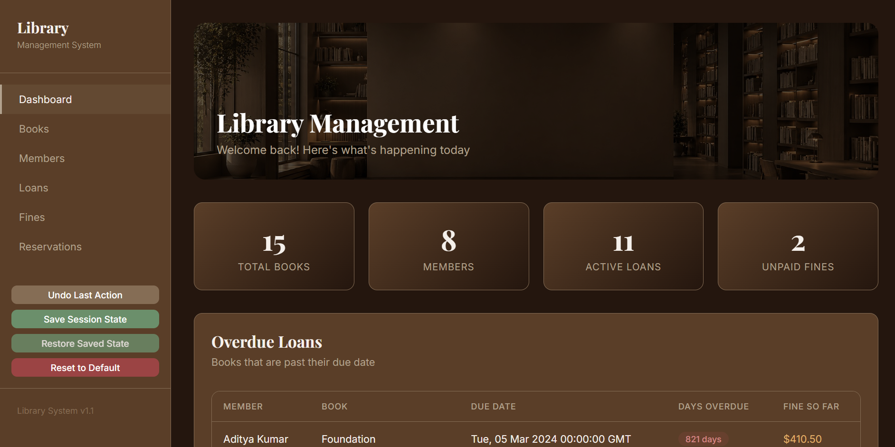
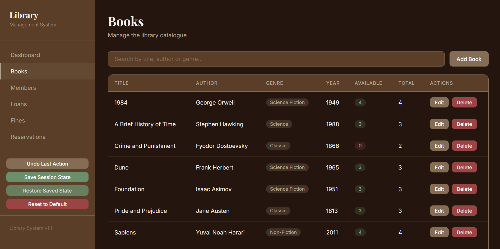
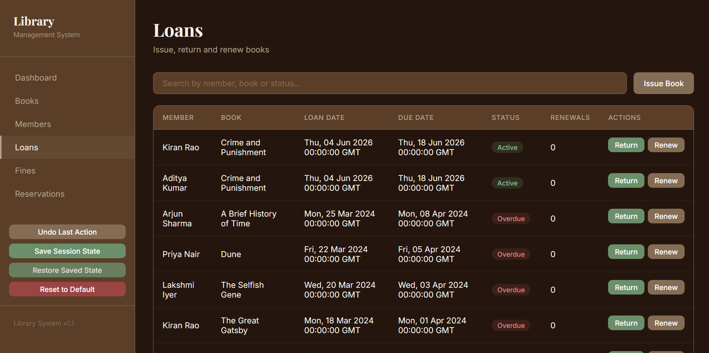
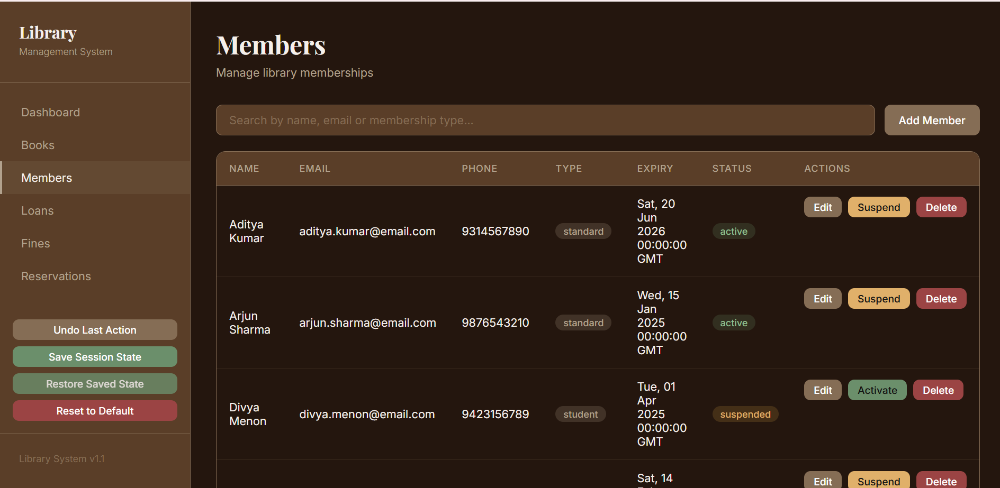
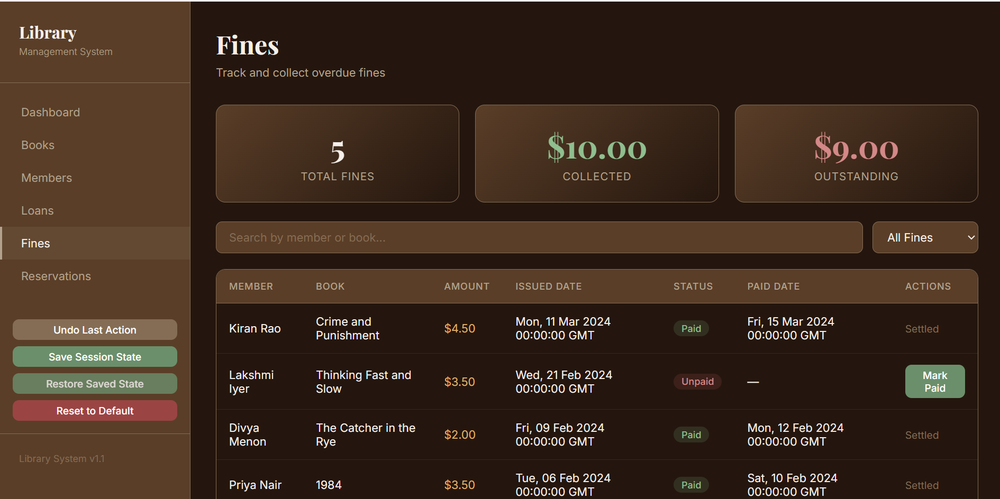
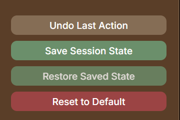

# Library Management System

A full-stack web application for managing daily library operations built as a portfolio project using MySQL, Flask, and React.

---

## Tech Stack

| Layer | Technology |
|---|---|
| Database | MySQL 8.0 |
| Backend | Python 3 + Flask (RESTful, Blueprint architecture) |
| Frontend | React.js (SPA) + Axios |
| Styling | Custom CSS, Playfair Display + Inter, warm brown palette |

---

## Features

### Core Modules
- **Books** — Full catalogue management with live inventory tracking
- **Members** — Register members (Standard / Student / Premium), auto-expiry dates, one-click Suspend / Activate toggle
- **Loans** — Issue and return books with tier-based due dates; automatic fine generation on overdue returns
- **Fines** — Track unpaid fines, mark payments, view monthly revenue breakdown
- **Reservations** — Queue-based waitlist with automatic position shifting on cancellation

### Advanced: Global State Management
| Feature | How it works |
|---|---|
| **Undo** | A global Axios interceptor snapshots the full DB before every POST / PUT / DELETE — one click rolls back |
| **Save Checkpoint** | Saves the current full DB state in memory for later restore |
| **Restore Checkpoint** | Rewinds the database to the last saved checkpoint |
| **Factory Reset** | Wipes all records, resets all `AUTO_INCREMENT` counters, and re-seeds clean baseline data atomically |

---

## Database Schema

Five tightly coupled tables. FK constraints enforced at the application layer (not SQL `ON DELETE CASCADE`) to allow business-logic validation before any deletion.

```
books          → book_id, isbn, title, author, genre, year_published, total_copies, available_copies
members        → member_id, full_name, email, phone, join_date, expiry_date, membership_type, status
loans          → loan_id, book_id (FK), member_id (FK), loan_date, due_date, return_date, renewed_count
fines          → fine_id, loan_id (FK), member_id (FK), amount, issued_date, paid, paid_date
reservations   → reservation_id, book_id (FK), member_id (FK), reserved_date, queue_position, notified
```

**Indexes:** overdue loans, member borrowing history, expiry campaigns, genre aggregations, fine lookups

**Triggers:** `trg_manage_copies_insert` and `trg_manage_copies_update` automatically decrement / increment `available_copies` on loan insert and return

---

## SQL Query Library (`/queries`)

33 queries across three difficulty tiers:

| File | Queries | Concepts |
|---|---|---|
| `01_basic.sql` | Q1–Q8 | SELECT, WHERE, GROUP BY, JOIN, aggregation |
| `02_intermediate.sql` | Q9–Q17 | Subqueries, LEFT JOIN, CASE, HAVING, self-joins |
| `03_advanced.sql` | Q18–Q33 | Window functions, CTEs, recursive CTEs, pivot, cohort analysis, rolling averages |

---

## Backend Highlights

**Atomic Loan Issuance — Race-Condition Safe**
```sql
-- Row-level lock inside conn.start_transaction()
UPDATE books SET available_copies = available_copies - 1
WHERE book_id = ? AND available_copies > 0
```

**Pre-Deletion Validation**
Before deleting a member, the backend blocks if they have unreturned books or unpaid fines. If clear, it deletes: fines → reservations → loans → member (in order).

**Tier-Based Due Dates**
| Membership | Loan Period |
|---|---|
| Standard | 14 days |
| Student | 21 days |
| Premium | 30 days |

**Automatic Fine Calculation**
On return, the backend calculates `days_overdue × $0.50` and inserts a fine record automatically.

---

## Frontend Highlights

- **Global Axios Interceptor** — fires `POST /api/system/snapshot` before every mutating request; powers Undo with zero per-component logic
- **Disabled (not hidden) zero-inventory books** — out-of-stock books appear grayed out with "Not available - Taken" label in the issue dropdown
- **Context-aware forms** — `status` field hidden during member creation (defaults to `active`), only shown on edit
- **Suspend / Activate toggle** — one-click button directly in the members table
- **Safe data parsing** — MySQL `TINYINT` booleans and empty date strings explicitly coerced in JS to prevent rendering crashes

---

## Getting Started

### Prerequisites
- Python 3.10+
- Node.js 18+
- MySQL 8.0

### 1. Database Setup
```bash
mysql -u root -p < schema/create_tables.sql
mysql -u root -p library_db < schema/indexes.sql
mysql -u root -p library_db < schema/trigger.sql
mysql -u root -p library_db < schema/seed_data.sql
```

### 2. Backend
```bash
cd backend
python -m venv venv
venv\Scripts\activate        # Windows
# source venv/bin/activate   # Mac / Linux

pip install -r requirements.txt

# Copy and fill in your DB credentials
cp .env.example .env

flask run
# API running at http://localhost:5000
```

### 3. Frontend
```bash
cd frontend
npm install
npm start
# App running at http://localhost:3000
```

---

## Project Structure

```
library-system-fullstack/
├── backend/
│   ├── routes/
│   │   ├── __init__.py
│   │   ├── books.py
│   │   ├── fines.py
│   │   ├── loans.py
│   │   ├── members.py
│   │   ├── reservations.py
│   │   ├── reset.py
│   │   └── system.py           ← Undo / Checkpoint / Factory Reset
│   ├── app.py
│   ├── config.py
│   ├── requirements.txt
│   └── .env.example
├── frontend/
│   └── src/
│       ├── api/
│       │   └── axios.js        ← Global snapshot interceptor
│       ├── components/
│       │   ├── Navbar.jsx
│       │   └── Sidebar.jsx
│       ├── pages/
│       │   ├── Dashboard.jsx
│       │   ├── Books.jsx
│       │   ├── Members.jsx
│       │   ├── Loans.jsx
│       │   ├── Fines.jsx
│       │   └── Reservations.jsx
│       ├── styles/
│       │   ├── library-bg.jpg
│       │   └── theme.css
│       ├── App.jsx
│       └── index.js
├── queries/
│   ├── 01_basic.sql
│   ├── 02_intermediate.sql
│   └── 03_advanced.sql
├── schema/
│   ├── create_tables.sql
│   ├── indexes.sql
│   ├── seed_data.sql
│   └── trigger.sql
├── .gitignore
└── README.md
```

---

## Screenshots

<!-- Replace with your actual screenshots after uploading to /screenshots folder -->

### Dashboard

> Live stats: total books, members, active loans, unpaid fines. Overdue loans table with days overdue and fine so far.

### Books

> Full catalogue with available / total copies badge. Add and edit via modal.

### Issue a Loan

> Book dropdown showing out-of-stock titles disabled and labeled "Not available - Taken".

### Members

> Member table with one-click Suspend / Activate toggle. Status badge color-coded.

### Fines

> Fines table with paid / unpaid filter. Revenue breakdown by month below.

### State Management (Sidebar)

> Undo, Save Checkpoint, Restore, and Factory Reset buttons in the sidebar.

---

## Environment Variables

Copy `.env.example` to `.env` inside `/backend` and fill in your values:

```
DB_HOST=localhost
DB_USER=root
DB_PASSWORD=your_password
DB_NAME=library_db
DB_PORT=3306
```

---
